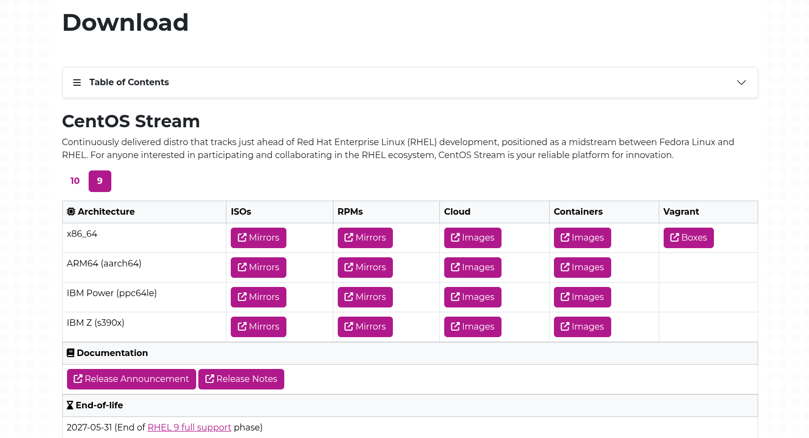

**[1]**  This is the configuration examples for CentOS Stream 9 that is the upstream branch of Red Hat Enterprise Linux 9.x.
CentOS Stream 9 will be supported until the end of full support phase of RHEL 9.

Download the CentOS Stream 9 ISO file for installation from the following site. 

=> http://mirror.stream.centos.org/9-stream/BaseOS/x86_64/iso/

    blackhawk@thinkpad-e14:~/Downloads$ ls CentOS-Stream-9-x86_64-dvd.iso 
    CentOS-Stream-9-x86_64-dvd.iso
    