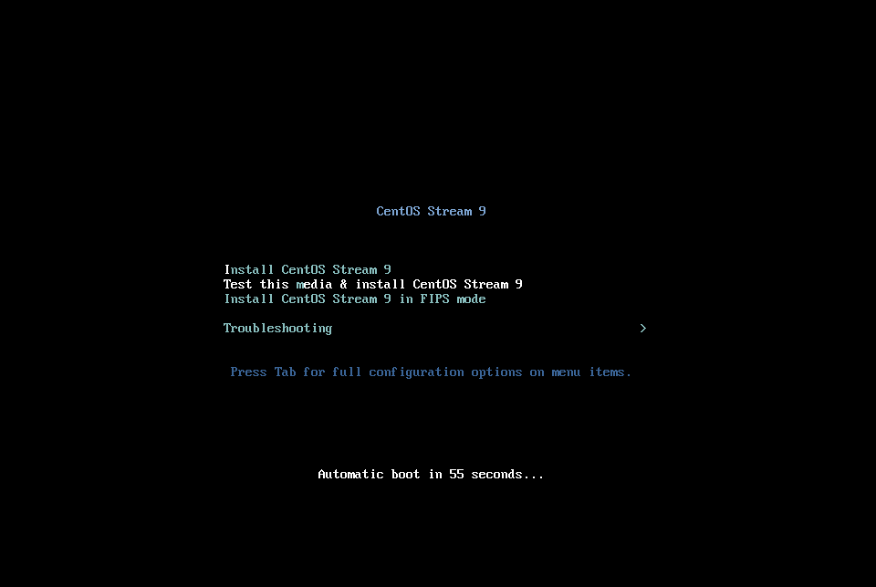
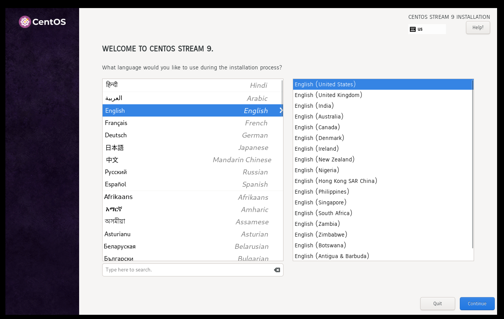
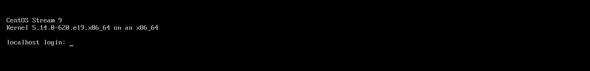

**[1]** Insert the CentOS Stream 9 installation disk on your computer and restart it, then, CentOS Stream 9 Installer starts and following screen is displayed. Push the Enter key to proceed

**[2]**	Select the language you'd like to use during the installation. The selected language on here also will be set the default System language If you never change [Language Support] setting in next step.

**[3]**	This is the default Installation Summary section for some basic configurations. On this example, Configure Keyboard Map first on [LOCALIZATION] category, Click [Keyboard] icon.

**[4]**	Back to the default Installation Summary section like [3], Next, set your timezone, Click [Time & Date] icon. Click a point on the map you'd like to set your timezone and push [Done] button which is on the upper left.

**[5]** Back to the default Installation Summary section like [3], Next, Click [Software Selection] icon to install CentOS Stream. Choose the Software Selection on the list you'd like to install. On this example, it Chooses [Server] selection.

**[6]**  Back to the default Installation Summary section like [3], Next, Click [Installation Destination] icon to select a disk you install CentOS Stream. If some disks are attached on your computer, you need to select an installation destination disk. Furthermore, if you'd like to edit the partition layouts manually, select [Custom] on the [Storage Configuration] section, or if you select [Automatic] on it, partitioning are automatically done. Then partitioning is configured as [/boot], [/], [/home], [swap]. (but if the size of destination disk is small like follows, [/home] is not separated). If That's OK all, Click [Done] button that is upper-left to finish disk configuration.

**[7]** Back to the default Installation Summary section like [3], Next, Click [Network & Host Name] icon. If you already have a Hostname for this new CentOS Stream Server, Input the Hostname on [Host Name] field. (possible to set it after installing)

**[8]**	Back to the default Installation Summary section like [3], Next, Click [Root Password] icon under [USER SETTINGS] category. Set root account password on here if you enable root user account.

**[9]** Back to the default Installation Summary section like [3], Next, Click [User Creation] icon under [USER SETTINGS] category. Create a common user account on here. If you disable root user account on previous section, check a box [Make this user administrator] to grant administrative privilege to this common account.

**[10]** Confirm Selections and If that's OK all, Click [Begin Installation] to install CentOS Stream.

**[11]** After finishing Installation, Click [Reboot System] button on the lower right to restart computer.

**[12]** After restarting computer, login prompt is shown like follows. Login with root user or a common user you set during the installation. If logined normally, CentOS Stream Installation successfully finished.

