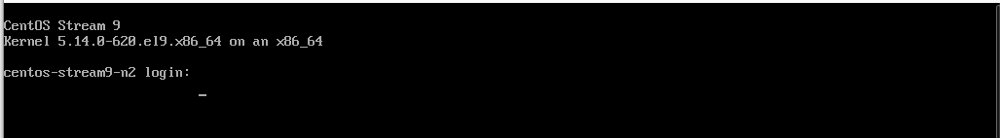
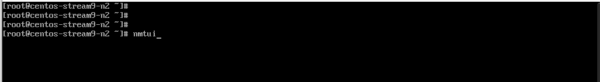
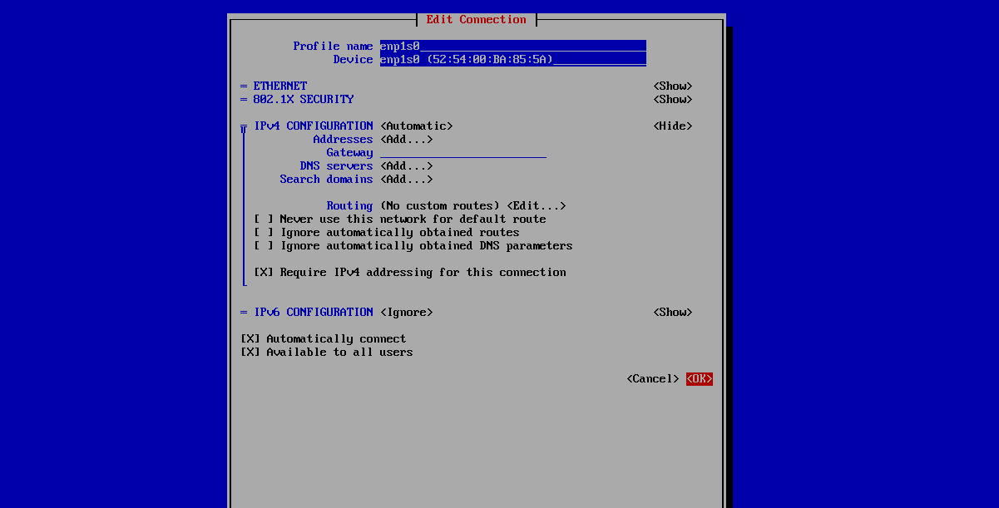
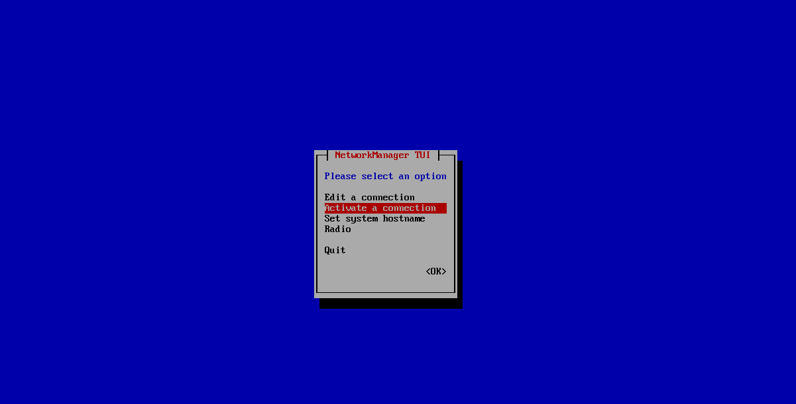
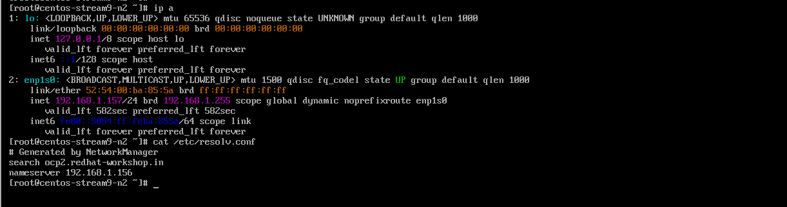

Follow the steps : 

1. Login into the client machine. 

2. Run "nmtui" command. 

3. Edit a connection. 

4. Edit enp1s0 Ethernet. (choose your own ethernet)

5. Set IPv4 Automatic configuration. and IPv6 disabled/ignore. 

6. Goto activate a connection. 

7. Go back and deactivate a connection. 

8. Activate a connection. 

9. Quit

10. Check IP Address and DNS Resolution. 

